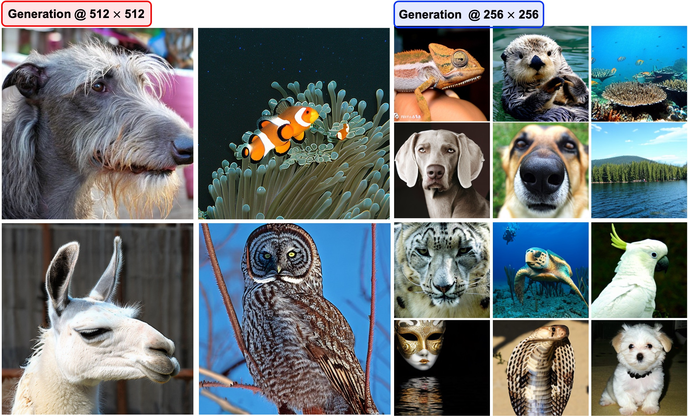

## No Alignment Needed for Generation: Learning Linearly Separable Representations in Diffusion Models ##
[](https://arxiv.org/pdf/2509.21565)

We propose Linear SEParability (LSEP) as a regularization method for training. Promoting the linear separability of intermediate layer representations using a linear probe (classifier), LSEP yields substantial improvements in both training efficiency and generative performance on flow-based transformer architectures (SiTs). Our approach achieves FID of **1.42** on the 256 × 256 and **1.66** on the 512 × 512 ImageNet dataset *without relying on
any large-scale external encoder*.


<!--  -->
<p align="center">
  
</p>

---

### 1. Create Conda Environment and Install Requirements

```bash
conda create -n LSEP python=3.9 -y
conda activate LSEP

cd LSEP
pip install requirement.txt
```

### 2. Dataset
Please download [ImageNet](https://www.image-net.org/download.php) and follow the preprocessing protocols described in [EDM2](https://github.com/NVlabs/edm2) and [REPA](https://github.com/sihyun-yu/REPA/tree/main/preprocessing). Then, specify the path using the `--data-dir` configuration.


### 3. Training / Sampling / Evaluation
```bash
sh main_LSEP.sh
```
You can configure the hyperparameters in `main_LSEP.sh` (Please refer to the settings in Tabs. 1 and 5).
1) `--uncond-prob`     : Probability for unconditioning for linear prob branch
2) `--encoder-depth`   : Target depth
3) `--crop-start`      : Random cropping window size
4) `--weights-type`, `--weight-start`, `--weight-end`, `--n-weights` : Weighting schedule

For additional customization or hyperparameter tuning, edit `main_LSEP.sh` accordingly.

For evaluation, please download the reference batches of ImageNet (256 × 256 and 512 × 512) from [ADM](https://github.com/openai/guided-diffusion/tree/main/evaluations) and place them under `./evaluator/`


### 4. Pre-trained Models

We provide pre-trained SiT-XL models with LSEP for ImageNet at 256 and 512 resolutions. Pre-trained models are available at the following here [link](https://www.dropbox.com/scl/fo/gx39twsc9u688t1h8frmu/APWfpyw-GzH3M7OncePnTLw?rlkey=wnmhyj1dr3c2e2eevu6io2ndz&dl=0). Please download and place the pre-trained models under: `./exp/pretrain`

```bash

sample_dir="./samples"
ckpt="lsep_imagenet_256"  
cfg_scale=1.0
cfg_guidance=1.0

torchrun --nnodes=1 --nproc_per_node=4 generate.py \
  --model SiT-$model/2 \
  --num-fid-samples 50000 \
  --ckpt ./exps/pretrain/${ckpt}.pt \
  --path-type linear \
  --per-proc-batch-size 64 \
  --mode sde \
  --num-steps 250 \
  --cfg-scale $cfg_scale \
  --guidance-high $cfg_guidance \
  --name_add "pretrain" \
  --sample_dir $sample_dir

```
| ImageNet Size |$\qquad$ Model                 | Epoch               | FID (w/o CFG) | FID (w/ CFG) |
|:----:|--------------------|:-----------------:|:-------------:|:------------:|
| 256  | SiT-XL (Baseline)     | 1400              | 8.3           | 2.06         |
|      | SiT-XL + **LSEP**     | **800**               | **5.7**           | **1.42**         |
| 512  | SiT-XL (Baseline)     | 600               | -             | 2.62         |
|      | SiT-XL + **LSEP**     | **240**               | -             | **2.00**         |
|      | SiT-XL + **LSEP** (Fine tuning) | **100**     | -             | **1.66**         |


## Acknowledgements

This codebase is mainly built upon [SiT](https://github.com/willisma/SiT) and [REPA](https://github.com/sihyun-yu/REPA) repositories.

## 📝 Citation
If you use this code, please cite our paper:
```bibtex

@article{yun2025LSEP,
  title={No alignment needed for generation: Learning linearly separable representations in diffusion models},
  author={Yun, Junno and Al{\c{c}}alar, Ya{\c{s}}ar Utku and Ak{\c{c}}akaya, Mehmet},
  journal={arXiv preprint arXiv:2509.21565},
  year={2025}
}

```
